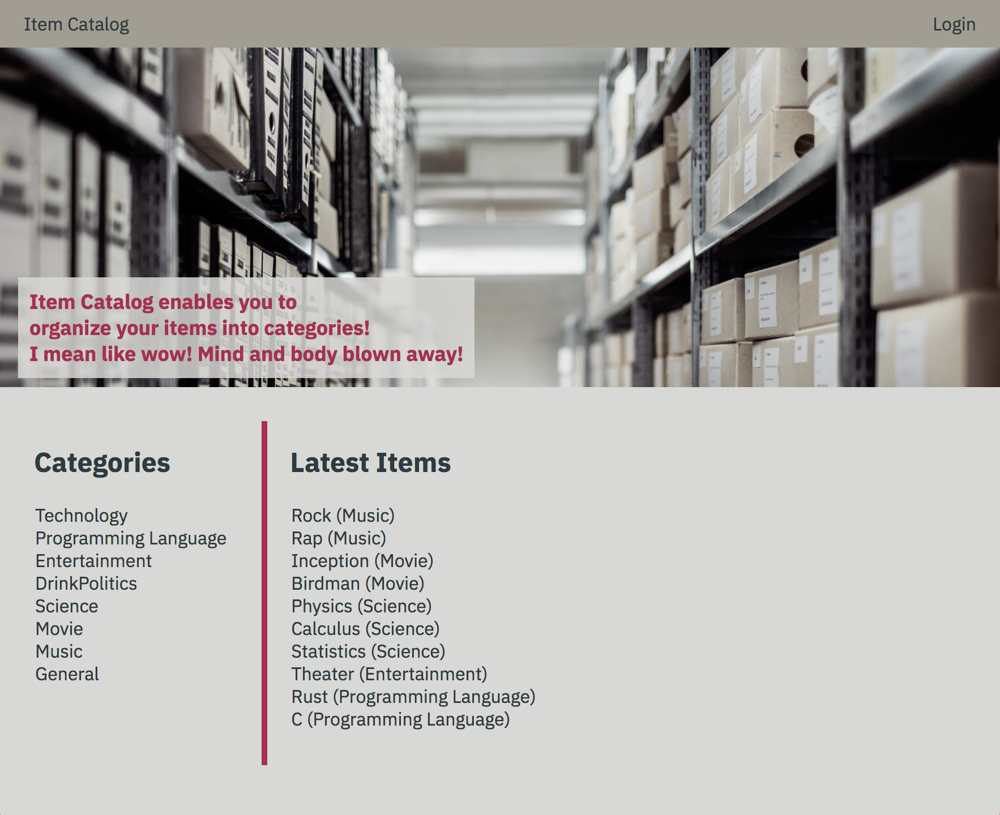
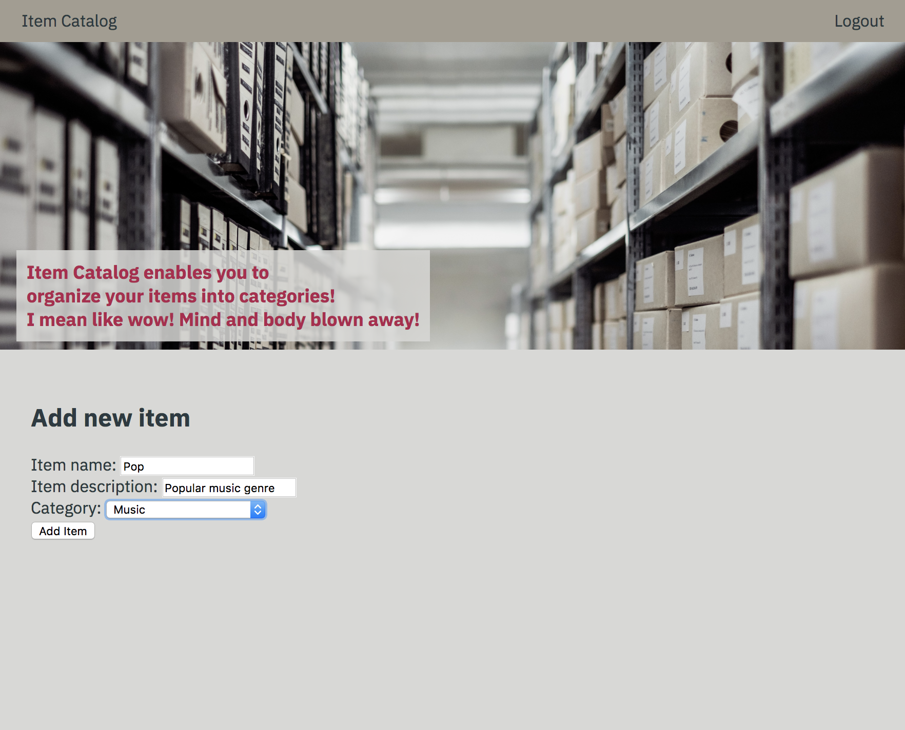
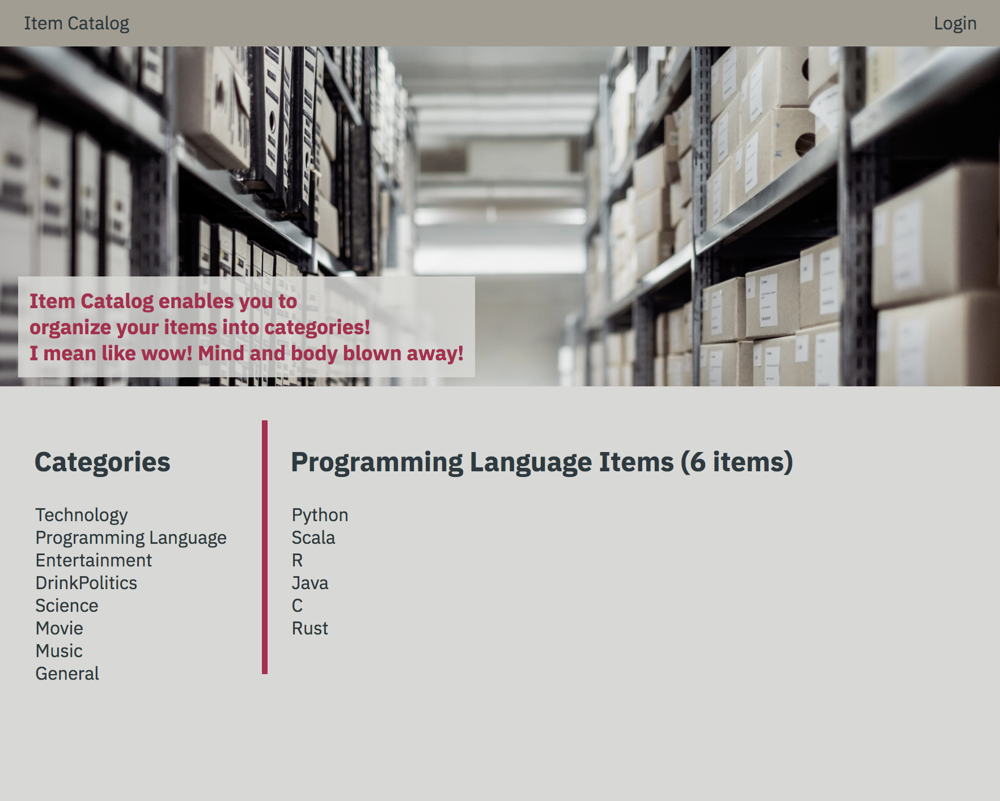
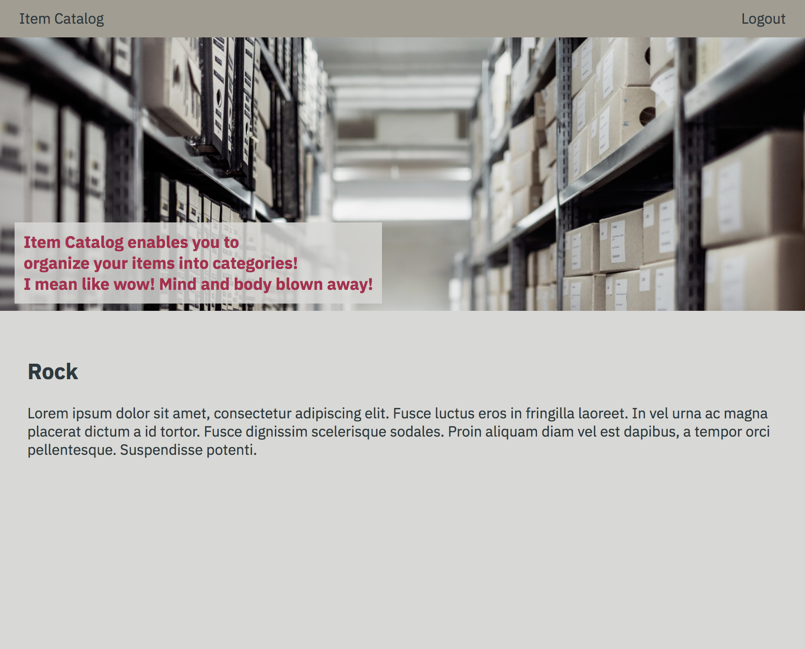
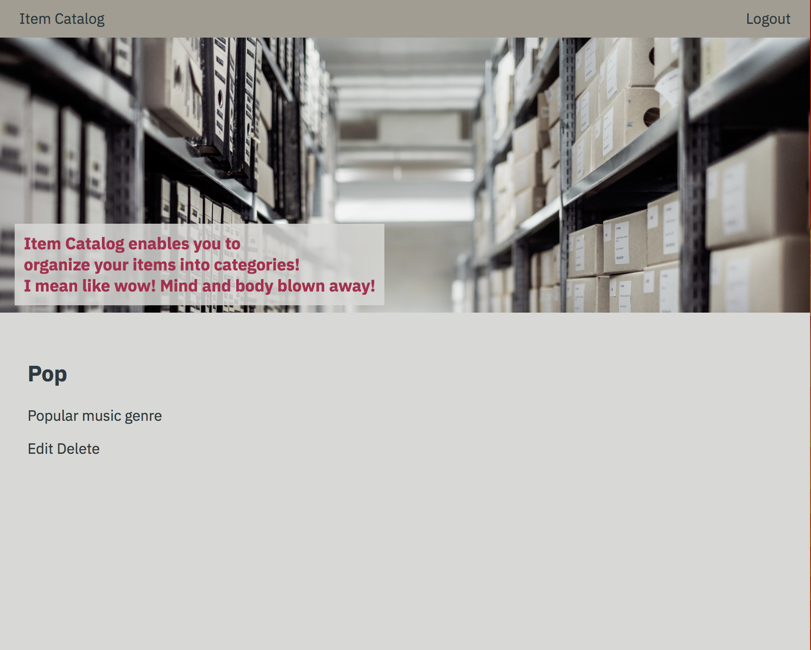
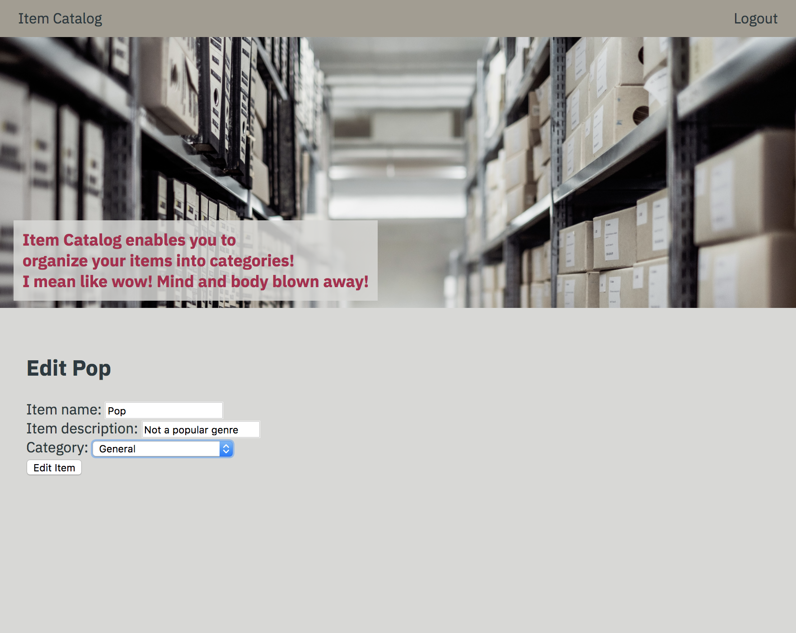
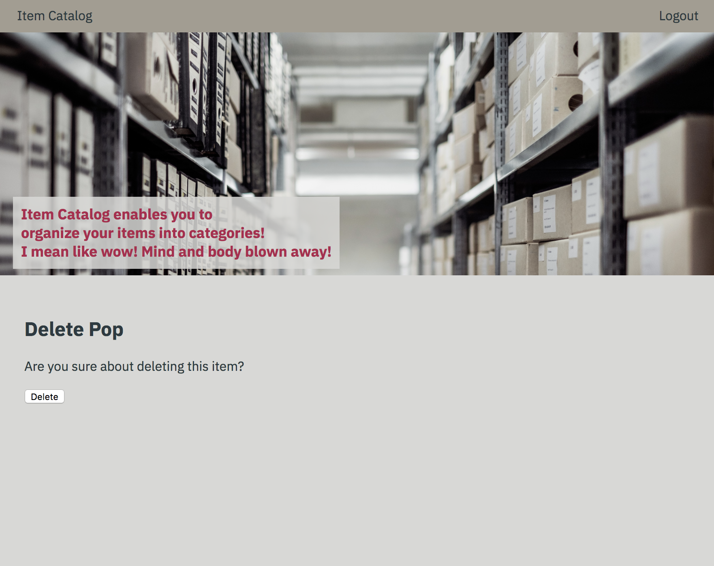
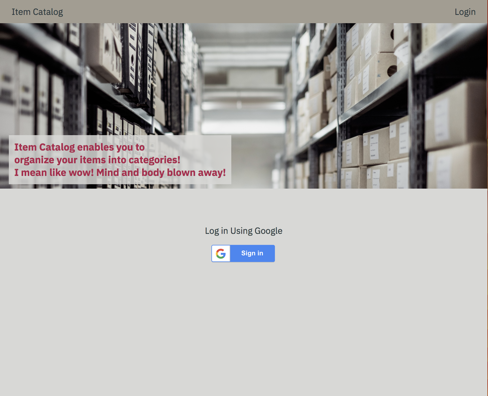

# Item Catalog Web Application

## About
A RESTful web application created with Flask framework. For data operations, it uses SQLite database and SQLAlchemy ORM. In addition, OAuth2 is implemented using Google that provides authentication for further CRUD functionality on the application. 

## Technologies used
- Python
- HTML
- CSS
- OAuth
- Flask Framework
- Jinja2
- SQLAlchemy

## How to run

### Dependencies
In order to run this application you need python 3 with SQLAlchemy and Flask installed. In addition you need to configure things on Google for authentication and authorization functionalities.

- Python 3
- Flask
- SQLAlchemy
- YAML

### Configure Database

Two files are provided to get started with the database.

- Run the `database_setup.py` inside `src/utils/` to create the database
- It's optional, but you can run the `populate_database.py` to populate the database with dummy data

### Enable Google Login
To get the Google login working follow these steps:

1. Go to [Google Dev Console](https://console.developers.google.com) and select Credentials
2. Select Create Crendentials, then OAuth Client ID and Select Web application
3. Enter name `Item Catalog Web Client`
4. Authorized JavaScript origins = `http://localhost:8081`
5. Authorized redirect URIs = `http://localhost:8081/oauth2callback`
6. Select Create
7. Create a file named `params.yaml` from the included templated in this repo `(params_template.yaml)` and replace `xxxx` with the Client ID
8. On the Dev Console Select Download JSON and rename the JSON file to client_secrets.json and place it in the root directory of this repo

### Run

In order to run the the service run the `app.py` inside the `src` directory. You can visit the app by visiting: `http://localhost:8081/`

## Functionality

### JSON Endpoint
Catalog JSON: `/catalog`
    - Returns the whole catalog data in JSON format

### Operations

#### Homepage

`/` or `/categories`

- Not logged in

- Logged in (Add item link appears, login button changes to logout)

#### Adding a new item

`/new_item` (User should be logged in)

#### Listing items for a specific category

`/{category_id}/items` 

#### Checking a specific item

`/{category_id}/{item_id}` 

- To check the details on an item. If the logged in user is the owner of the item, the user can edit or delete the item.

#### Editing and deleting an item

`/{category_id}/{item_id}/edit`

- Editing an item (User should be the owner of the item)

`/{category_id}/{item_id}/delete`

- Deleting an item (User should be the owner of the item)

#### Login

`/login`

- Login to the app using a Google account

